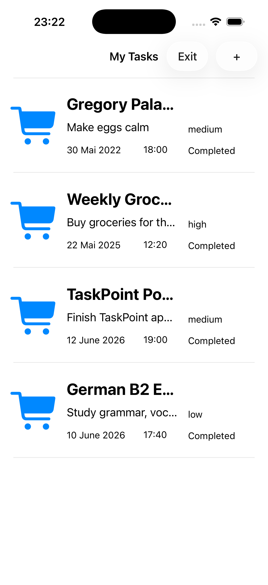
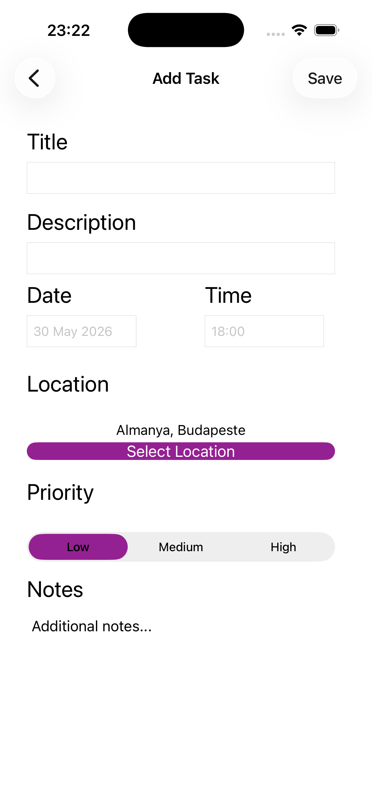
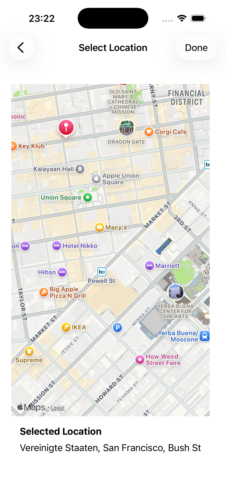
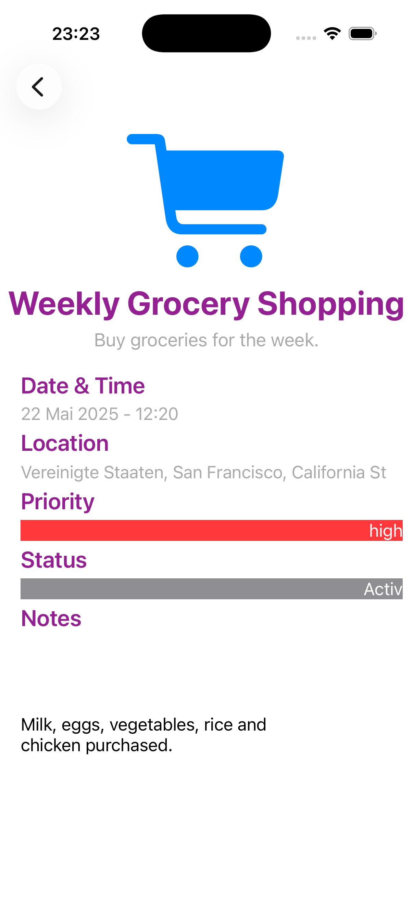

# TaskPoint 📍

TaskPoint is a task management application developed with UIKit for iOS. The app allows users to create, manage, and organize tasks while associating them with real-world locations using Apple Maps.

## Features

* 🔐 Firebase Authentication

  * User registration
  * User login
  * Automatic session persistence
  * Secure sign out

* 📝 Task Management

  * Create new tasks
  * View all saved tasks
  * Delete tasks
  * View detailed task information

* 💾 Core Data Integration

  * Persistent local storage
  * Offline task access
  * Fast data retrieval

* 🗺️ MapKit Integration

  * Select task locations directly on the map
  * Reverse geocoding support
  * Save location information with tasks

* 📊 Task Details

  * Title
  * Description
  * Date and time
  * Priority level
  * Completion status
  * Notes
  * Location information

## Technologies

* Swift
* UIKit
* Core Data
* Firebase Authentication
* MapKit
* Core Location
* Storyboard

## Screenshots

### Splash Screen


### Authentication


### Task List



### Add Task



### Location Selection



### Task Details



## Project Structure

```text

TaskPoint
│
├── Authentication
│   ├── LoginViewController
│   └── Firebase Auth
│
├── Tasks
│   ├── Task List
│   ├── Task Detail
│   └── Add Task
│
├── Data
│   └── Core Data
│
├── Maps
│   └── MapKit Integration
│
└── Models
    └── Task Model
```


## Author

Developed by Ahmet Cilingir.
